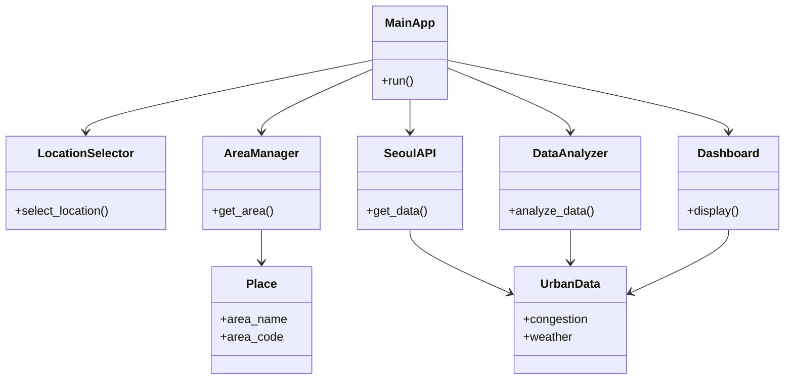

# Seoul Real-Time Urban Data

## 프로젝트 소개

본 프로젝트는 서울시 실시간 도시데이터 API를 활용하여 사용자가 서울의 특정 지역을 선택하면 해당 지역의 실시간 정보를 확인할 수 있는 프로그램입니다.

사용자는 강남역, 홍대입구, 잠실 등 서울의 주요 지역을 선택할 수 있으며, 선택한 지역의 혼잡도 및 날씨 정보를 확인할 수 있습니다.

본 프로젝트는 객체지향 프로그래밍(OOP)의 개념을 적용하여 실제 공공데이터를 활용하는 것을 목표로 합니다.

## 주요 기능

- 서울 지역 선택
- 실시간 인구 혼잡도 확인
- 실시간 날씨 정보 확인
- 사용자 친화적인 형태로 데이터 제공
- 객체지향 프로그래밍 구조 적용

## 클래스 구조

### Place
선택한 지역의 이름, 코드 등 변하지 않는 기본 정보를 저장합니다.

### UrbanData
선택한 지역의 실시간 데이터를 저장합니다.

### SeoulAPI
서울시 실시간 도시데이터 API에 요청을 보내고 데이터를 가져옵니다.

### AreaManager
지원하는 지역 목록을 관리하고 지역 검색 기능을 제공합니다.

### DataAnalyzer
API 데이터를 분석하여 사용자가 이해하기 쉬운 형태로 변환합니다.

### LocationSelector
사용자의 지역 선택을 처리합니다.

### Dashboard
분석된 데이터를 사용자에게 출력합니다.

### MainApp
프로그램 전체 흐름을 관리하고 각 클래스를 연결합니다.

## 프로그램 동작 흐름

User
↓
LocationSelector
↓
AreaManager
↓
Place
↓
SeoulAPI
↓
UrbanData
↓
DataAnalyzer
↓
Dashboard
↓
결과 출력

## 프로젝트 구조

## 프로젝트 구조

```text
Seoul-Real-Time-Urban-Data/
│
├── src/
│   ├── main.py
│   ├── seoul_api.py
│   ├── urban_data.py
│   ├── place.py
│   ├── area_manager.py
│   ├── data_analyzer.py
│   ├── location_selector.py
│   └── dashboard.py
│
├── docs/
│   ├── Seoul_Real_Time_Urban_Data_Proposal.docx
│
├── LICENSE
├── README.md
├── requirements.txt
└── .gitignore
```

## 클래스 다이어그램



## 역할 분담

| 역할 | 담당 업무 |
|------|-----------|
| 팀장 | 프로젝트 관리, 일정 조율, 문서 작성, 최종 검토 |
| 팀원 1 | API 연동 |
| 팀원 2 | 데이터 처리 및 클래스 구현 |
| 팀원 3 | UI 및 출력 화면 |
| 팀원 4 | GitHub 관리 및 테스트 |
| 전원 | 발표 준비 및 PPT 내용 검토 |

## License

본 프로젝트는 MIT License를 따릅니다.

자세한 내용은 LICENSE 파일을 참고하세요.
