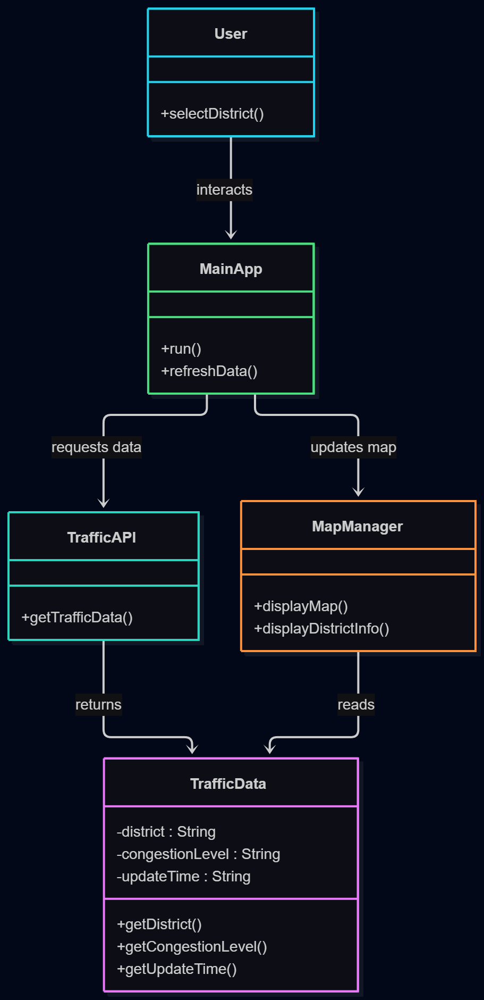

# Seoul Traffic Viewer

## Project Overview

Seoul Traffic Viewer is an Object-Oriented Programming (OOP) project that visualizes traffic congestion information in Seoul through an interactive map interface.

The system allows users to view traffic conditions in different districts of Seoul using color-based indicators. Users can select a district, check its traffic congestion level, and explore traffic information through a simple and intuitive interface.

This project aims to demonstrate the application of Object-Oriented Programming concepts such as encapsulation, abstraction, modularity, and class interaction.

---

## Contributors

| Name | Student Number | GitHub ID | Role |
|------|------|------|------|
| 에르덴자야 | 2025203503 | Ginaeyo | Team Leader |
| 민경환 | 2023203089 | kimmolang11 | Team Member |
| 김효중 | 2022321028 | a01056405156-ctrl | Team Member |
| 할리오나 | 2025403507 | liuka0715 | Team Member |
| 원미혜 | 2024403150 | today0505 | Team Member |

---

## Development Status

| Feature | Status |
|----------|----------|
| Project Planning | ✅ Complete |
| GitHub Repository Setup | ✅ Complete |
| Class Design | ✅ Complete |
| Traffic Data Processing | 🟡 In Progress |
| Map Visualization | 🟡 In Progress |
| API Integration | ⬜ Planned |
| Testing | ⬜ Planned |

---

## How to Run

### Requirements

- Python 3.x

### Installation

1. Clone the repository

```bash
git clone https://github.com/Ginaeyo/seoul-traffic-viewer.git
```

2. Move to the project directory

```bash
cd seoul-traffic-viewer
```

3. Run the application

```bash
python main.py
```

---

## Data Source

### Planned Data Sources

- Seoul Open Data API
- Simulated Traffic Data (for prototype development)

### Additional Data

- Seoul District Information
- Seoul Geographic Information

These datasets will be used to improve traffic visualization and provide district-based traffic information.

---

## Main Features

### Seoul Map Display

Display a map of Seoul for traffic visualization.

### Traffic Congestion Visualization

Traffic conditions are represented using color indicators:

- 🟢 Green = Low Congestion
- 🟡 Yellow = Medium Congestion
- 🔴 Red = High Congestion

### District Selection

Users can select districts such as:

- Gangnam
- Songpa
- Jongno
- Mapo
- Yongsan

### District Traffic Information

Display traffic information for the selected district.

### Refresh Traffic Data

Users can refresh traffic information to view updated data.

---

## Class Diagram



---

## Project Structure

```text
seoul-traffic-viewer
│
├── app
│   ├── traffic_data.py
│   ├── traffic_api.py
│   ├── map_manager.py
│   ├── user.py
│   └── main_app.py
│
├── docs
│   ├── architecture.md
│   ├── class_diagram.png
│   └── use_case_diagram.png
│
├── assets
│
├── README.md
├── CHANGELOG.md
├── CONTRIBUTING.md
└── LICENSE
```

---

## Class Design

### TrafficData

#### Responsibility

Stores and manages traffic congestion information.

#### Attributes

- district
- congestionLevel
- updateTime

#### Methods

- getCongestion()
- setCongestion()

---

### TrafficAPI

#### Responsibility

Retrieves traffic data from a data source.

#### Methods

- getTrafficData()
- updateTrafficData()

---

### MapManager

#### Responsibility

Displays and updates the traffic map.

#### Methods

- displayMap()
- updateMap()

---

### User

#### Responsibility

Handles user interaction.

#### Attributes

- selectedDistrict

#### Methods

- selectDistrict()

---

### MainApp

#### Responsibility

Controls the overall application flow.

#### Methods

- run()
- initialize()

---

## System Flow

1. The user selects a district.
2. MainApp receives the request.
3. TrafficAPI retrieves traffic information.
4. TrafficData stores and manages the data.
5. MapManager visualizes the information on the map.
6. The result is displayed to the user.

---

## Object-Oriented Programming Concepts

### Encapsulation

Each class manages its own data and functionality.

### Abstraction

Complex traffic data processing is hidden behind simple methods.

### Modularity

The system is divided into independent classes with specific responsibilities.

### Reusability

Classes can be reused and extended in future versions.

---

## Expected Outcome

- Interactive traffic visualization system
- District-based traffic information display
- Practical application of OOP concepts
- Foundation for future real-time traffic monitoring systems

---

## Development Plan

### Phase 1
- Create project structure
- Design classes
- Set up GitHub repository

### Phase 2
- Implement TrafficData and TrafficAPI
- Develop data processing functions

### Phase 3
- Implement MapManager and User interaction
- Integrate all classes

### Phase 4
- Testing and bug fixing
- Final presentation preparation

---

## GitHub Repository

https://github.com/Ginaeyo/seoul-traffic-viewer

---

## License
This project was developed for the Object-Oriented Programming Team Project at Kwangwoon University.
